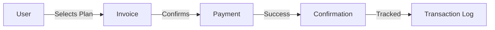

<div align="center">

# 🤖 Professional Telegram Bot

### *Next-Generation Telegram Bot with AI Integration*

[](https://www.python.org/)
[](https://t.me/my1testprojectbot)
[](LICENSE)
[](https://github.com/SllHex/TelegramBot-Professional/stargazers)

**A production-ready, feature-rich Telegram bot showcasing modern development practices**

[**🚀 Try Live Demo**](https://t.me/my1testprojectbot) • [**📚 Documentation**](docs/) • [**🐛 Report Bug**](.github/ISSUE_TEMPLATE/bug_report.md) • [**✨ Request Feature**](.github/ISSUE_TEMPLATE/feature_request.md)

</div>

---

## 🌟 Highlights

<table>
<tr>
<td width="50%">

### 🤖 **AI-Powered**
- Google Gemini integration for text generation
- Free AI image creation via Pollinations.ai
- Smart text summarization
- Context-aware responses

</td>
<td width="50%">

### 📁 **File Processing**
- PDF to text extraction
- Image compression & optimization
- Format conversion support
- Detailed file analysis

</td>
</tr>
<tr>
<td width="50%">

### 💳 **Payment Ready**
- Complete payment flow demo
- Multiple pricing tiers
- Invoice generation
- Transaction tracking

</td>
<td width="50%">

### 🛡️ **Admin Panel**
- Real-time analytics dashboard
- User management system
- Broadcast messaging
- Activity monitoring

</td>
</tr>
</table>

---

## 🎮 Live Demo

<div align="center">

### **Try it now!**

[](https://t.me/my1testprojectbot)

**[@my1testprojectbot](https://t.me/my1testprojectbot)**

```
Just send /start to begin exploring!
```

</div>

### ✨ What You Can Test:

| Feature | Description |
|---------|-------------|
| 🧠 **AI Text Generation** | Create content using Google Gemini AI |
| 🎨 **AI Image Creation** | Generate images from text descriptions |
| 📄 **PDF Processing** | Extract text from PDF documents |
| 🖼️ **Image Tools** | Compress and optimize images |
| 💰 **Payment Flow** | Complete payment integration showcase |
| 📊 **Statistics** | Personal activity tracking & analytics |

---

## 🚀 Quick Start

### Prerequisites

```bash
✓ Python 3.9 or higher
✓ Telegram Bot Token (from @BotFather)
✓ Google Gemini API Key (free tier available)
```

### Installation

```bash
# 1️⃣ Clone the repository
git clone https://github.com/SllHex/TelegramBot-Professional.git
cd TelegramBot-Professional

# 2️⃣ Install dependencies
pip install -r requirements.txt

# 3️⃣ Configure environment
cp .env.example .env
# Edit .env and add your credentials

# 4️⃣ Run the bot
python main.py
```

### Expected Output

```
🤖 Starting Professional Telegram Bot...
✅ Bot started successfully!
📱 Send /start to begin
```

---

## ⚙️ Configuration

### Environment Variables

| Variable | Status | Description |
|----------|--------|-------------|
| `BOT_TOKEN` | **Required** | Your Telegram bot token from [@BotFather](https://t.me/BotFather) |
| `ADMIN_USER_IDS` | **Required** | Admin user IDs (comma-separated) |
| `GEMINI_API_KEY` | **Recommended** | Google Gemini API key for AI features ([Get free key](https://makersuite.google.com/app/apikey)) |
| `PAYMENT_PROVIDER_TOKEN` | Optional | Payment provider token for payment demo |
| `DEBUG_MODE` | Optional | Enable debug logging (default: `False`) |
| `MAX_FILE_SIZE_MB` | Optional | Maximum file upload size in MB (default: `10`) |

### Getting Your API Keys

<details>
<summary><b>📍 How to get Telegram Bot Token</b></summary>

1. Open Telegram and search for [@BotFather](https://t.me/BotFather)
2. Send `/newbot` command
3. Follow the instructions to create your bot
4. Copy the bot token provided
5. Add it to your `.env` file

</details>

<details>
<summary><b>🔑 How to get Google Gemini API Key (FREE)</b></summary>

1. Visit [Google AI Studio](https://makersuite.google.com/app/apikey)
2. Sign in with your Google account
3. Click "Create API Key"
4. Copy the generated key
5. Add it to your `.env` file

**Benefits:**
- ✅ 60 requests per minute
- ✅ Generous monthly quota
- ✅ No credit card required
- ✅ Free forever

</details>

<details>
<summary><b>👤 How to get your Telegram User ID</b></summary>

1. Open Telegram and search for [@userinfobot](https://t.me/userinfobot)
2. Start the bot
3. Your user ID will be displayed
4. Add it to `ADMIN_USER_IDS` in `.env`

</details>

---

## 📖 Features

### 🤖 AI Capabilities

<table>
<tr>
<td>

**Text Generation**
```
Powered by Google Gemini
- Creative content creation
- Question answering
- Context-aware responses
- Natural conversations
```

</td>
<td>

**Image Generation**
```
Using Pollinations.ai (FREE)
- Text-to-image conversion
- High-quality outputs
- No API key needed
- Instant generation
```

</td>
</tr>
<tr>
<td>

**Text Summarization**
```
Intelligent condensation
- Long document support
- Key point extraction
- Multiple languages
- Fast processing
```

</td>
<td>

**Smart Replies**
```
Context-aware AI
- Conversation understanding
- Relevant suggestions
- Natural language
- Quick responses
```

</td>
</tr>
</table>

### 📁 File Processing

| Tool | Supported Formats | Features |
|------|------------------|----------|
| **PDF Extractor** | `.pdf` | Multi-page support, character count, plain text output |
| **Image Compressor** | `.jpg`, `.png`, `.webp` | Quality control, size optimization, before/after stats |
| **File Analyzer** | All types | Metadata display, MIME detection, Telegram file ID |
| **Format Converter** | Various | Multi-format support, quality preservation |

### 💰 Payment System



**Available Plans:**
- 💎 **Premium** - $9.99/month
- 🌟 **Pro** - $19.99/month
- 🚀 **Enterprise** - $49.99/month

### 🛡️ Admin Features

<div align="center">

| Feature | Description |
|---------|-------------|
| 📊 **Dashboard** | Real-time user metrics and activity stats |
| 👥 **User Management** | View all users, activity logs, user info |
| 📢 **Broadcasting** | Mass messaging with delivery tracking |
| 📈 **Analytics** | Detailed performance and usage statistics |

</div>

---

## 🏗️ Project Structure

```
TelegramBot-Professional/
│
├── 📄 main.py                  # Bot entry point
├── ⚙️ config.py                # Configuration management
├── 🗄️ database.py              # SQLite database operations
├── 📦 requirements.txt         # Python dependencies
│
├── 🎮 handlers/                # Feature handlers
│   ├── start.py               # /start, /help, /profile
│   ├── ai_features.py         # AI text & image generation
│   ├── file_processing.py     # PDF, image tools
│   ├── payment_demo.py        # Payment integration
│   └── admin_panel.py         # Admin dashboard
│
├── 🔧 utils/                   # Utility modules
│   ├── keyboards.py           # Inline keyboard layouts
│   ├── decorators.py          # Custom decorators
│   └── loading.py             # Loading animations
│
├── 📚 docs/                    # Documentation
│   ├── API.md                 # API integration guide
│   └── DEPLOYMENT.md          # Deployment instructions
│
└── 🐙 .github/                 # GitHub templates
    ├── workflows/ci.yml       # CI/CD automation
    └── ISSUE_TEMPLATE/        # Issue templates
```

---

## 💻 Usage

### User Commands

| Command | Description |
|---------|-------------|
| `/start` | 🚀 Launch bot and show main menu |
| `/help` | ℹ️ Display help information and available commands |
| `/profile` | 👤 View your profile and usage statistics |
| `/stats` | 📊 Show your detailed activity statistics |

### Admin Commands

| Command | Access | Description |
|---------|--------|-------------|
| `/admin` | 🔐 Admin only | Access the admin dashboard with full controls |

### Interactive Navigation

The bot uses beautiful **inline keyboards** for easy navigation:

```
Main Menu
├── 🤖 AI Features
│   ├── ✍️ Text Generation
│   ├── 🎨 Image Creation
│   ├── 📝 Summarization
│   └── 💬 Smart Reply
│
├── 📁 File Tools
│   ├── 📄 PDF to Text
│   ├── 🖼️ Compress Image
│   ├── ℹ️ File Info
│   └── 🔄 Convert Format
│
├── 💳 Payment Demo
│   ├── 💎 Premium Plan
│   ├── 🌟 Pro Plan
│   └── 🚀 Enterprise Plan
│
├── 📊 My Statistics
└── ⚙️ Settings
```

---

## 🛠️ Development

### Running in Development Mode

```bash
# Enable debug mode in .env
DEBUG_MODE=True

# Run with detailed logging
python main.py
```

### Code Quality Standards

We follow industry best practices:

- ✅ **PEP 8** Python style guide
- ✅ **Type hints** for better code clarity
- ✅ **Comprehensive docstrings**
- ✅ **Modular architecture**
- ✅ **Error handling** throughout

### Adding New Features

```python
# 1. Create handler in handlers/
async def my_feature(update, context):
    await update.message.reply_text("New feature!")

# 2. Register in main.py
application.add_handler(CommandHandler("myfeature", my_feature))

# 3. Add to keyboard in utils/keyboards.py
InlineKeyboardButton("🆕 My Feature", callback_data='my_feature')
```

---

## 🌐 Deployment

<div align="center">

### Choose Your Deployment Method

| Platform | Difficulty | Cost | Uptime |
|----------|-----------|------|--------|
| 🖥️ **VPS** | Medium | $5-10/mo | 99.9% |
| 🐳 **Docker** | Easy | $5-10/mo | 99.9% |
| ☁️ **Heroku** | Easy | Free-$7/mo | 99% |
| 🚂 **Railway** | Very Easy | Free-$5/mo | 99.5% |

</div>

### Quick Deploy Options

```bash
# VPS (Ubuntu/Debian)
git clone https://github.com/SllHex/TelegramBot-Professional.git
cd TelegramBot-Professional
pip3 install -r requirements.txt
python3 main.py

# Docker
docker build -t telegram-bot .
docker run -d --env-file .env telegram-bot

# Heroku
heroku create
git push heroku main
heroku ps:scale worker=1
```

📖 **For detailed deployment guides, see [DEPLOYMENT.md](docs/DEPLOYMENT.md)**

---

## 🤝 Contributing

We welcome contributions! Here's how you can help:

<div align="center">

| Type | How to Contribute |
|------|------------------|
| 🐛 **Bug Reports** | Use our [bug report template](.github/ISSUE_TEMPLATE/bug_report.md) |
| ✨ **Feature Requests** | Use our [feature request template](.github/ISSUE_TEMPLATE/feature_request.md) |
| 🔧 **Code Contributions** | Fork, develop, and submit a PR |
| 📖 **Documentation** | Improve docs and add examples |

</div>

### Development Workflow

```bash
# 1. Fork the repository
# 2. Create your feature branch
git checkout -b feature/amazing-feature

# 3. Make your changes and commit
git commit -m 'feat: add amazing feature'

# 4. Push to your branch
git push origin feature/amazing-feature

# 5. Open a Pull Request
```

📖 **Read our [Contributing Guidelines](CONTRIBUTING.md) for more details**

---

## 📝 License

This project is licensed under the **MIT License** - see the [LICENSE](LICENSE) file for details.

```
MIT License - Copyright (c) 2024

Permission is hereby granted, free of charge, to any person obtaining a copy
of this software to deal in the Software without restriction...
```

---

## 🙏 Acknowledgments

Built with amazing open-source technologies:

<div align="center">

| Technology | Purpose |
|-----------|---------|
| [python-telegram-bot](https://github.com/python-telegram-bot/python-telegram-bot) | Telegram Bot API wrapper |
| [Google Gemini](https://ai.google.dev/) | AI text generation |
| [Pollinations.ai](https://pollinations.ai/) | Free AI image generation |
| [Pillow](https://python-pillow.org/) | Image processing |
| [PyPDF2](https://pypdf2.readthedocs.io/) | PDF manipulation |

</div>

---

## 📞 Support & Links

<div align="center">

### Get Help & Stay Connected

[](https://t.me/my1testprojectbot)
[](docs/)
[](https://github.com/SllHex/TelegramBot-Professional/issues)
[](https://github.com/SllHex/TelegramBot-Professional/discussions)

</div>

---

## 🗺️ Roadmap

### Current Version (v1.0) ✅

- [x] AI text & image generation
- [x] File processing tools
- [x] Payment integration demo
- [x] Admin panel with analytics
- [x] User statistics tracking

### Upcoming Features 🚀

- [ ] 🌍 Multi-language support (i18n)
- [ ] 🎤 Voice message transcription
- [ ] 📊 Advanced analytics dashboard
- [ ] 🔗 Webhook deployment support
- [ ] ⚡ Redis caching integration
- [ ] 🗄️ PostgreSQL database option
- [ ] 🤖 Custom AI model training
- [ ] 👥 Group chat management features

---

## ⭐ Show Your Support

If you find this project useful, please consider:

<div align="center">

⭐ **Star this repository**
🍴 **Fork for your own projects**
📢 **Share with others**
💬 **Provide feedback**

[](https://github.com/SllHex/TelegramBot-Professional/stargazers)
[](https://github.com/SllHex/TelegramBot-Professional/network/members)

</div>

---

<div align="center">

### Built with ❤️ using Python & Telegram Bot API

**[🤖 Try Bot](https://t.me/my1testprojectbot) • [📚 Documentation](docs/) • [🚀 Deployment Guide](docs/DEPLOYMENT.md)**

⬆️ [Back to Top](#-professional-telegram-bot)

---

**Made with passion by developers, for developers** 🚀

</div>
